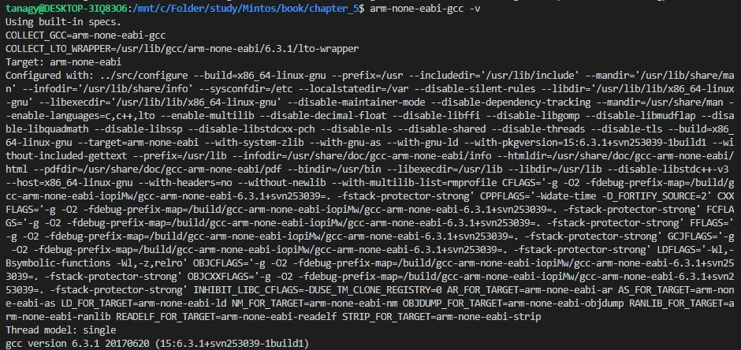

## 개발환경 구성

### 1. 컴파일러 설치
- 크로스 컴파일러로 GCC 사용.
	- ARM용 GCC 사용
- 그 중 gcc-arm-none-eabi를 사용하기로 함.
- sudo apt install gcc-arm-none-eabi 
- 터미널에 arm-none-eabi-gcc -v 를 입력해 제대로 설치가 되었는지 확인.

### 2. QEMU 설치
- QEMU는 가상머신 에뮬러이터를 지원하는 어플리케이션.
- VM과 같은 역할을 함.
- qemu-system-arm 을 설치하도록 함.
-  sudo apt install qemu-system-arm
- qemu-system-arm --version을 입력해 제대로 설치가 되었는지 확인.

### 3. 
<!--stackedit_data:
eyJoaXN0b3J5IjpbNjQyNjE0NDI4LC02NTYxMTUyNDhdfQ==
-->