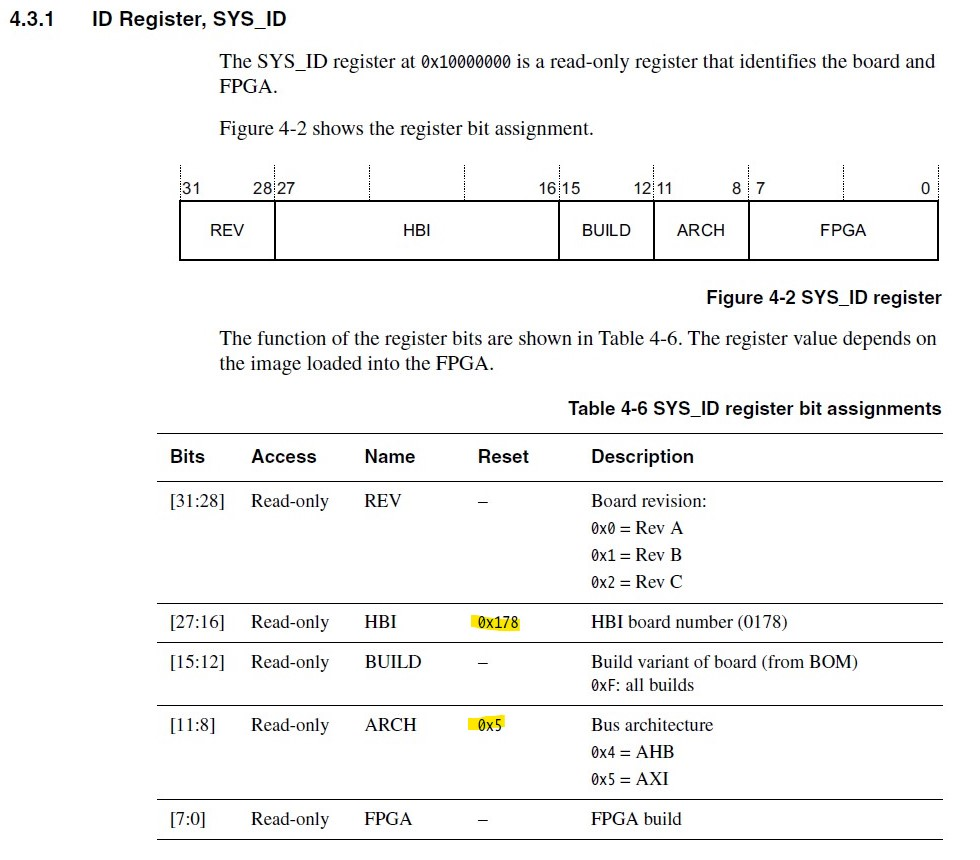

# 3장. 일단 시작하기

### 3.1 리셋 벡터
- 리셋 벡터는 전원이 들어오면 가장 먼저 실행되는 명령어를 저장함.
- 메모리 주소 **0x00000000** 를 가짐
- 아래는 Enyry.S
~~~nasm
.text
	.code  32 

	.global  vector_start
	.global  vector_end
	vector_start:
		MOV  R0, R1
	vector_end:
		.space  1024, 0
.end
~~~ 

code 3.1

- code32 
	- 명령어의 크기가 32비트, 즉 4바이트
- .global
	- C언어에서의 extern과 같은 역할
- MOV R0, R1
	- 의미없는 코드
- .space 1024, 0
	- 해당 위치부터 1024 바이트를 0으로 채움.
- 컴파일 및 바이너리 확인.

### 3.2 실행파일 만들기
 - 링커란 여러 오브젝트 파일을 linking해 하나의 실행 파일로 만드는 프로그램
 - 이 링커에 정보를 던져 주는 파일을 링커스크립트라고 부른다

~~~nasm
ENTRY(vector_start)
SECTIONS
{
    . = 0x0;

    .text :
    {
        *(vector_start)
        *(.text .rodata)
    }
    .data :
    {
        *(.data)
    }
    .bss :
    {
        *(.bss)
    }
}
~~~

코드 3.4

- Entry 지시어는 시작 위치의 심벌을 지정함.
- SECTION은 해당 블럭 영역이 섹션 배치 설정 정보를 가지고 있음을 노티.
- line 4 : 첫번째 섹션이 메모리 0x00000000에 위치함.
- .text, .data .bss 순서대로 메모리에 설정함.
- .text의 경우 vecto_start 영역을 가장 처음에 설정.
- 아래는 컴파일 및 objdump 내용

### 3.3 QEMU에서 실행
 - gdb 설치
	 - sudo apt install gdb-arm-none-eabi
	 - 하지만 위의 명령어는 현재 설치하려고 하면 찾을 수 없는 패키지이다. 그냥 gdb-multiarch 를 설치하면 된다!

- QEMU 실행
 ~~~
tanagy@DESKTOP-3IQ83O6:/mnt/c/Folder/study/EmbededOS/chapter_3/boot$ qemu-system-arm -M realview-pb-a8 -kernel navilos.axf -S -gdb tcp::1234,ipv4
shared memfd open() failed: Function not implemented
pulseaudio: pa_context_connect() failed
pulseaudio: Reason: Connection refused
pulseaudio: Failed to initialize PA contextaudio: Could not init `pa' audio driver
...
 ~~~
- gdb 실행
~~~
tanagy@DESKTOP-3IQ83O6:/mnt/c/Folder/study/EmbededOS/chapter_3/boot$ gdb-multiarch

GNU gdb (Ubuntu 8.1-0ubuntu3.2) 8.1.0.20180409-git
Copyright (C) 2018 Free Software Foundation, Inc.
License GPLv3+: GNU GPL version 3 or later <http://gnu.org/licenses/gpl.html>
This is free software: you are free to change and redistribute it.
There is NO WARRANTY, to the extent permitted by law.  Type "show copying"
and "show warranty" for details.
This GDB was configured as "x86_64-linux-gnu".
Type "show configuration" for configuration details.
For bug reporting instructions, please see:
<http://www.gnu.org/software/gdb/bugs/>.
Find the GDB manual and other documentation resources online at:
<http://www.gnu.org/software/gdb/documentation/>.
For help, type "help".
Type "apropos word" to search for commands related to "word".
(gdb) target remote:1234
Remote debugging using :1234
warning: No executable has been specified and target does not support
determining executable automatically.  Try using the "file" command.
0x00000000 in ?? ()
(gdb) x/4x 0
0x0:    0xe1a00001      0x00000000      0x00000000      0x00000000
(gdb)
~~~
- ``target remote:1234 ``
	- 1234번 포트로 원격 디버깅
- ``(gdb) x/4x``
	- 0x00000000 메모리 주소에서 4바이트 출력
- 짠 코드가 QEMU 메모리에 제대로 올라 갔음을 확인.

### 3.4 Build 자동화 하기
 - 귀찮게 모든 명령어를 작성하지 않기 위해 자동화를 진행.
~~~makeFile
ARCH = armv7-a
MCPU = cortex-a8
  
CC = arm-none-eabi-gcc
AS = arm-none-eabi-as
LD = arm-none-eabi-ld
OC = arm-none-eabi-objcopy

LINKER_SCRIPT = ./navilos.ld

ASM_SRCS = $(wildcard boot/*.S)
ASM_OBJS = $(patsubst boot/%.S, build/%.o, $(ASM_SRCS))

navilos = build/navilos.axf
navilos_bin = build/navilos.navilos_bin  

.PHONY: all clean run debug gdb
 
all: $(navilos) 

clean:
	@rm -fr build

run: $(navilos)
	qemu-system-arm -M realview-pb-a8 -kernel $(navilos)

  

debug: $(navilos)
	qemu-system-arm -M realview-pb-a8 -kernel $(navilos) -S -gdb tcp::1234,ipv4  

gdb:
	gdb-multiarch

$(navilos): $(ASM_OBJS)  $(LINKER_SCRIPT)
$(LD) -n -T $(LINKER_SCRIPT) -o $(navilos)  $(ASM_OBJS)
$(OC) -O binary $(navilos)  $(navilos_bin)

build/%.o: boot/%.s
mkdir -p $(shell dirname $@)
$(AS) -march=$(ARCH) -mcpu=$(MCPU) -g -o $@  $<
~~~

- ``ASM_SRCS = $(wildcard boot/*.S)`` 
	- boot 디렉토리에서 확장자가 S인 파일 이름을 모두 ASM_SRC 변수에 저장
 - ``ASM_OBJS = $(patsubst boot/%.S, build/%.o, $(ASM_SRCS))``
	 - boot 디렉토리에서 확장자가 S일 파일들의 확장자를 .o로 변경.
	 - 이후 디렉토리를 build로 바꿔 ASM_OBJS 변수에 저장.
- 작성 완료 후 make all , make debug등 실행하면 앞서 했던 절차들이 자동화 되었음을 확인.

### 3.5 하드웨어  정보 읽어오기.
 - Entry.S 파일 내용 변경.
  ~~~ nasm
 .text
    .code 32

    .global vector_start
    .global vector_end

    vector_start:
        LDR R0, =0x10000000
        LDR R1, [R0]
        ;MOV R0, R1
    vector_end:
        .space 1024, 0
.end
~~~
- ``LDR R0, =0x10000000``
- ``LDR R1, [R0]``
	- R0에 0x10000000을 넣음
	- 해당 주소는 SYS_ID를 의미함. 
	- 하드웨어를 식별할 수 있는 정보를 가진 레지스터 (하단의 이미지 참조)
	
- 데이터시트에 명시되어 있듯이, 해당 주소의 값을 읽었을 때, 0x178과 0x5가 포함되어 있어야 함.
-  확인하기 위해 아래의 명령어를 입력함
	- make debug
	- make gdb
	- 이후 아래의 명령어를 계속 수행한다.
~~~
(gdb) target remote:1234
Remote debugging using :1234
warning: No executable has been specified and target does not support
determining executable automatically.  Try using the "file" command.
0x00000000 in ?? ()
(gdb) file build/navilos.axf
A program is being debugged already.
Are you sure you want to change the file? (y or n) y
Reading symbols from build/navilos.axf...done.
(gdb) list
1       .text
2           .code 32
3
4           .global vector_start
5           .global vector_end
6
7           vector_start:
8               LDR R0, =0x10000000
9               LDR R1, [R0]
10              ;MOV R0, R1
(gdb) info register
r0             0x0      0
r1             0x0      0
r2             0x0      0
r3             0x0      0
r4             0x0      0
r5             0x0      0
r6             0x0      0
r7             0x0      0
r8             0x0      0
r9             0x0      0
r10            0x0      0
r11            0x0      0
r12            0x0      0
sp             0x0      0x0 <vector_start>
lr             0x0      0
pc             0x0      0x0 <vector_start>
cpsr           0x400001d3       1073742291
fpscr          0x0      0
fpsid          0x410330c0       1090728128
---Type <return> to continue, or q <return> to quit---
fpexc          0x0      0
(gdb) s
vector_start () at boot/Entry.S:9
9               LDR R1, [R0]
(gdb) info register
r0             0x10000000       268435456
r1             0x0      0
r2             0x0      0
r3             0x0      0
r4             0x0      0
r5             0x0      0
r6             0x0      0
r7             0x0      0
r8             0x0      0
r9             0x0      0
r10            0x0      0
r11            0x0      0
r12            0x0      0
sp             0x0      0x0 <vector_start>
lr             0x0      0
pc             0x4      0x4 <vector_start+4>
cpsr           0x400001d3       1073742291
fpscr          0x0      0
fpsid          0x410330c0       1090728128
---Type <return> to continue, or q <return> to quit---
fpexc          0x0      0
(gdb) s
vector_start () at boot/Entry.S:10
10              ;MOV R0, R1
(gdb) i r
r0             0x10000000       268435456
r1             0x1780500        24642816
r2             0x0      0
r3             0x0      0
r4             0x0      0
r5             0x0      0
r6             0x0      0
r7             0x0      0
r8             0x0      0
r9             0x0      0
r10            0x0      0
r11            0x0      0
r12            0x0      0
sp             0x0      0x0 <vector_start>
lr             0x0      0
pc             0x8      0x8 <vector_start+8>
cpsr           0x400001d3       1073742291
fpscr          0x0      0
fpsid          0x410330c0       1090728128
---Type <return> to continue, or q <return> to quit---
~~~
- ``(gdb) i r``
``r0             0x10000000       268435456``
``r1             0x1780500        24642816``
- 위의 값을 보았을 때 0x1780500 으로 데이터시트와 동일한 값이 들어가 있는 것을 확인할 수 있다.
- 값으로 보았을 때 ARCH=AXI, Board Rev=A 임을 알 수 있다.

### 3.6 요약
여기까지의 내용은 앞으로 진행할 내용의 기본이 되는 부분임. 앞으로 본격적으로 프로젝트를 시작할 것임.
<!--stackedit_data:
eyJoaXN0b3J5IjpbLTE3MDI3OTkyMDcsNjEyNTY2ODMzLC03Nj
A2NjQwMzgsMTQzNzE1MjgzMCwtMTQxMjc3MTM3Miw1NDI5MTI4
MDYsOTkzMjM5OTk0LC00NTMwNjQ3NDgsMjA4ODIwNzEzNV19
-->