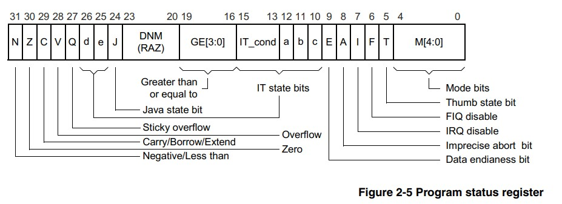

### 4. 부팅하기
- 부팅이란 정의하기 나름이지만, 여기서는 시스템에 전원이 들어가고 ARM 코어가 리셋 익셉션 핸들러를 모두 처리한 다음에 본격적으로 C언어 코드로 넘어가기 직전 까지를 말한다.

### 4.1 메모리의 설계
- 메로리의 영역은 아래의 세가지로 나뉘어져 있다.
	- text 영역
		- 코드가 있는 공간, 코드이므로 임의로 변경하면 안된다.
	- data 영역
		- 초기화한 전역 변수가 있는 공간, 전역 변수를 선언할 때 초기 값을 할당해서 선언하면 해당 전역 변수가 점유하는 공간은 여기에 할당됨.
	- bss 영역
		- 초기화하지 않은 전역 변수가 있는 공간. 초기화하지 않은 전역 변수이므로 빌드 완료되어 생성된 바이너리 파일에는 심벌과 크기만 들어있음.
- 위의 영역을 배치할 때, 각각의 특성들을 고려해서 해당 영역을 빠르고 적은 메모리에 배치할지,  느리고 큰 메모리에 배치할지 결정해야 한다.
- 하지만 QEMU는 128MB라는 광할한 메모리가 주어지기 때문에 큰 의미는 없다.

#### 메모리 영역에 배치
- text영역
	- 리눅스를 올리지 않는 작은 RTOS이므로 수십KB면 충분 하지만 1MB를 할당 하도록 하겠다.
	- 익셉션 백터 테이블을 text영역에 포함 하도록 한다.
	- 주소는 0x00000000 ~ 0x000FFFFF 가 되겠다.
- data영역, bss 영역
	- 데이터는 형태와 속성 이 두가지의 성질을 가지고 있다.
		- 데이터의 형태 : 동작 모드별 스택, 태스크 스택, 전역 변수, 동적 메모리 할당 영역
		- 데이터의 속성 : 성능 중시 데이터, 큰 공간이 필요한 데이터, 공유 데이터
	- 아래의 표대로 메모리를 배치 하도록 한다.
	
|동작 모드|크기|주소|
|--|--|--|
|USR, SYS|2MB|0x00100000 ~ 0x002FFFFF|
|SVC|1MB|0x00300000 ~ 0x003FFFFF |
|IRQ|1MB|0x00400000 ~ 0x004FFFFF |
|FIQ|1MB|0x00500000 ~ 0x005FFFFF |
|ABT|1MB|0x00600000 ~ 0x006FFFFF |
|UND|1MB|0x00700000 ~ 0x007FFFFF |

- RTOS를 개발할 것이므로, 태스크스택 영역도 생각해야 한다.
- 태스크마다 1MB씩 스택 영역을 할당할 것이므로, 64MB를 할당해야 한다.
- 따라서 나빌로스의 최대 태스크 수는 64개가 될 것이다.
- 여기까지 할당한 메모리 구조를 보면 아래와 같다.

### 4.2 익셉션 벡터 테이블 만들기
- 본격적으로 익셉션 핸들러를 작성해 보도록 하자.
~~~nasm
.text
    .code 32

    .global vector_start
    .global vector_end

    vector_start:
        LDR PC, reset_handler_addr
        LDR PC, undef_handler_addr
        LDR PC, svc_handler_addr
        LDR PC, pftch_abt_handler_addr        
        LDR PC, data_abt_handler_addr
        B .
        LDR PC, irq_handler_addr
        LDR PC, fiq_handler_addr

        reset_handler_addr:     .word reset_handler
        undef_handler_addr:     .word dummy_handler
        svc_handler_addr:       .word dummy_handler
        pftch_abt_handler_addr: .word dummy_handler        
        data_abt_handler_addr:  .word dummy_handler
        irq_handler_addr:       .word dummy_handler
        fiq_handler_addr:       .word dummy_handler        
    vector_end:

    reset_handler:
        LDR R0, =0x10000000
        LDR R1, [R0]
    
    dummy_handler:
        B .

.end
~~~

- 해당 코드를 실행시켜 보면, 앞서 작성한 3.5에서의 코드와 동일한 결과를 출력하는 것을 알 수 있다.
- 현재 dummy_handler로 무한루프 돌게 코딩되어 있고,  reset_handler에는 SYS_ID를 읽어오는 코드를 그대로 사용했기 때문이다.
- 이제 익셉션 핸들러 코드를 작성해 보자.

### 4.3 익셉션 핸들러 만들기
- 먼저 메모리 맵을 설정해 준다.
- 익셉션 백터 테이블은 하기의 주소에 나와 있다.
	- [http://infocenter.arm.com/help/index.jsp?topic=/com.arm.doc.ddi0211h/Babfeega.html](http://infocenter.arm.com/help/index.jsp?topic=/com.arm.doc.ddi0211h/Babfeega.html)
- Exception Entry and Exit은 아래의 이미지와 같다.
	- 
- 이제 4.1에서 설계한 메모리 맵을 C언어로 변환 하도록 하겠다.
~~~C
#define INST_ADDR_START     0
#define USRSYS_STACK_START  0x00100000
#define SVC_STACK_START     0x00300000
#define IRQ_STACK_START     0x00400000
#define FIQ_STACK_START     0x00500000
#define ABT_STACK_START     0x00600000
#define UND_STACK_START     0x00700000
#define TASK_STACK_START    0x00800000
#define GLOBAL_ADDR_START   0x04800000
#define DALLOC_ADDR_START   0x04900000

#define INST_MEM_SIZE       (USRSYS_STACK_START - INST_ADDR_START)
#define USRSYS_STACK_SIZE   (SVC_STACK_START - USRSYS_STACK_START)
#define SVC_STACK_SIZE      (IRQ_STACK_START - SVC_STACK_START)
#define IRQ_STACK_SIZE      (FIQ_STACK_START - IRQ_STACK_START)
#define FIQ_STACK_SIZE      (ABT_STACK_START - FIQ_STACK_START)
#define ABT_STACK_SIZE      (UND_STACK_START - ABT_STACK_START)
#define UND_STACK_SIZE      (TASK_STACK_START - UND_STACK_START)
#define TASK_STACK_SIZE     (GLOBAL_ADDR_START - TASK_STACK_START)
#define DALLOC_MEM_SIZE     (55 * 1024 * 1024)

#define USRSYS_STACK_TOP    (USRSYS_STACK_START + USRSYS_STACK_SIZE - 4)
#define SVC_STACK_TOP       (SVC_STACK_START + SVC_STACK_SIZE - 4)
#define IRQ_STACK_TOP       (IRQ_STACK_START + IRQ_STACK_SIZE - 4)
#define FIQ_STACK_TOP       (FIQ_STACK_START + FIQ_STACK_SIZE - 4)
#define ABT_STACK_TOP       (ABT_STACK_START + ABT_STACK_SIZE - 4)
#define UND_STACK_TOP       (UND_STACK_START + UND_STACK_SIZE - 4)
~~~
- C로 제작된 코드이지만, GCC로 컴파일 시 entry.S 어셈블리어 파일에서도 호출이 가능하다.
- 코드 내용은 컴퓨터 공학과 학생 1학년도 해독 가능할 정도로 쉬우므로 따로 하지 않겠다.
- 추가로 헤더 파일을 하나 더 생성 하도록 하자.
~~~C
/* PSR Mode Bit Values */
#define ARM_MODE_BIT_USR 0x10
#define ARM_MODE_BIT_FIQ 0x11
#define ARM_MODE_BIT_IRQ 0x12
#define ARM_MODE_BIT_SVC 0x13
#define ARM_MODE_BIT_ABT 0x17
#define ARM_MODE_BIT_UND 0x1B
#define ARM_MODE_BIT_SYS 0x1F
#define ARM_MODE_BIT_MON 0x16
~~~
- 위의 코드는 ARM의 cpsr에 값을 설정하여 동작 모드를 바꿀 수 있는 값들을 정의한 부분이다.
##
- 잠깐 딴길로 새겠지만,  ARM의 7가지 동작 모드에 대해 알고 가자.

| 모드 | 설명 |
|--|--|
| USR |일반적으로 사용하는 모드로 ARM과 Thumb가 있다. 운영체제를 이용한다면 일반적으로 USR 모드이다|
|FIQ|ARM 모드일 때만 동작하며 빠른 처리를 위해 뱅크드 레지스터라고 불리는 별도의 레지스터를 가지고 있다|
|IRQ|ARM 상태와 Thumb상태 모두 동작|
|SVC|시스템 코드를 수행하기 위한 보호모드, 시스템 콜을 호출하면 SVC 익셉션을 발생해 SVC 모드로 전환하게 된다. 순수 소프트웨어에 의한 익셉션|
|ABT|Data Abort나 Prefetch Abort가 발생했을 때 전환되는 동작 모드|
|SYS|사용자 프로세스가 임시로 커널 모드를 획득하는 경우 사용
|UND| Undefined instruction이 발생했을 때 진입하는 동작 모드|

- ARM은 32비트 범용 레지스터 31개와 상태 레지스터 6개를 가지고 있다.
- ARM은 범용 레지스터를 여러 동작 모드가 공유해 사용한다.
- 레지스터 R0~R15 와 CPSR이 있다.
- R0~R12까지를 범용 레지스터라고 부른다.
- R13은  SP, 즉 스택 포인터 레지스터라고 한다.
- R14는 LP, 즉 링크 레지스터이다. 함수를 호출할 때 리턴 어드레스를 가지고 있다.
- R15는 PC, 즉 다음 명령어가 있는 메모리 주소를 저장하고 있는 레지스터이다. ARM 모드일 때는 4바이트 증가하고, Thumb 모드일 때는 2바이트 증가한다.
## 
- ARM 모드와 Thumb모드에 대해서도 알아보자.
- Thumb모드란 16비트 명령어 집합을 말한다. R8  이상의 레지스터 사용이 제한된다.
- ARM은 32비트 명령어 집합이다.
##
- 프로그램 상태 레지스터에 대해 알아보자.
- 현재 상태를 저장하는 레지스터를 CPSR, 상태를 저장하는 레지스터를 SPSR이라고 한다. 
- 즉 SPSR은 CPSR의 백업이다. 따라서 구조가 똑같다.

- ``N`` 계산 결과가 음수일 때 1
- ``Z`` 계산 결과가 0일때 1
- ``C`` 계산 결과에 내림이 발생하거나 나눗셈을 할 때 자리 빌림이 발생하면 1
- ``V`` 계산 결과에 오버플로가 발생하면 1
- ``Q`` 곱셈을 할 때 32비트가 넘ㅇ

<!--stackedit_data:
eyJoaXN0b3J5IjpbMTExMzczMjAzOSwtMTc1MDkxNDg2NywyNz
gzMzQ2MiwtOTc3Mzg0NDU3LDE5MjA4MTc4MDksLTEwNTg4MzQ2
NDksLTc3MzU1NzAwOCw3NDQyODQwOTYsLTE0MTkyNjY0MjUsMT
UwMzU2NTg5MF19
-->