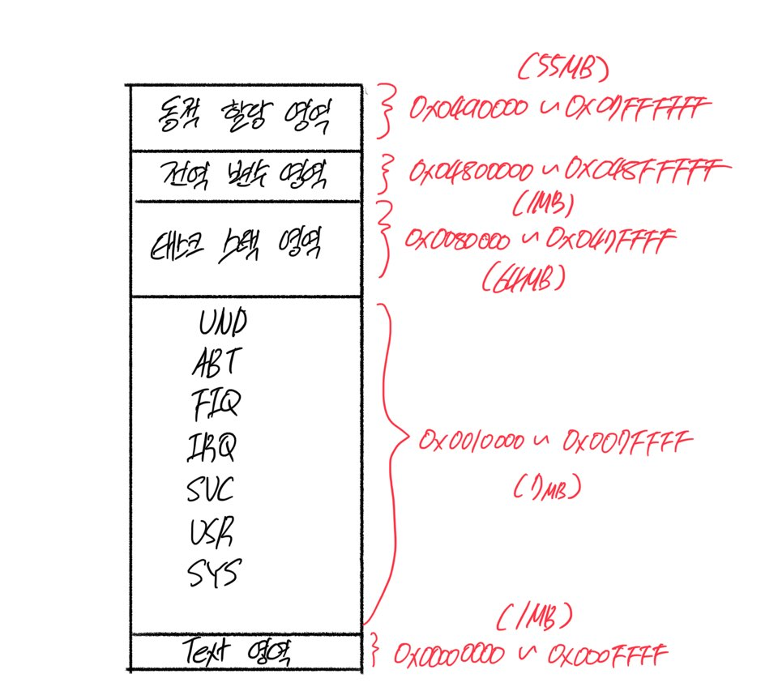

### 4. 부팅하기
- 부팅이란 정의하기 나름이지만, 여기서는 시스템에 전원이 들어가고 ARM 코어가 리셋 익셉션 핸들러를 모두 처리한 다음에 본격적으로 C언어 코드로 넘어가기 직전 까지를 말한다.

### 4.1 메모리의 설계
- 메로리의 영역은 아래의 세가지로 나뉘어져 있다.
	- text 영역
		- 코드가 있는 공간, 코드이므로 임의로 변경하면 안된다.
	- data 영역
		- 초기화한 전역 변수가 있는 공간, 전역 변수를 선언할 때 초기 값을 할당해서 선언하면 해당 전역 변수가 점유하는 공간은 여기에 할당됨.
	- bss 영역
		- 초기화하지 않은 전역 변수가 있는 공간. 초기화하지 않은 전역 변수이므로 빌드 완료되어 생성된 바이너리 파일에는 심벌과 크기만 들어있음.
- 위의 영역을 배치할 때, 각각의 특성들을 고려해서 해당 영역을 빠르고 적은 메모리에 배치할지,  느리고 큰 메모리에 배치할지 결정해야 한다.
- 하지만 QEMU는 128MB라는 광할한 메모리가 주어지기 때문에 큰 의미는 없다.

#### 메모리 영역에 배치
- text영역
	- 리눅스를 올리지 않는 작은 RTOS이므로 수십KB면 충분 하지만 1MB를 할당 하도록 하겠다.
	- 익셉션 백터 테이블을 text영역에 포함 하도록 한다.
	- 주소는 0x00000000 ~ 0x000FFFFF 가 되겠다.
- data영역, bss 영역
	- 데이터는 형태와 속성 이 두가지의 성질을 가지고 있다.
		- 데이터의 형태 : 동작 모드별 스택, 태스크 스택, 전역 변수, 동적 메모리 할당 영역
		- 데이터의 속성 : 성능 중시 데이터, 큰 공간이 필요한 데이터, 공유 데이터
	- 아래의 표대로 메모리를 배치 하도록 한다.
	
|동작 모드|크기|주소|
|--|--|--|
|USR, SYS|2MB|0x00100000 ~ 0x002FFFFF|
|SVC|1MB|0x00300000 ~ 0x003FFFFF |
|IRQ|1MB|0x00400000 ~ 0x004FFFFF |
|FIQ|1MB|0x00500000 ~ 0x005FFFFF |
|ABT|1MB|0x00600000 ~ 0x006FFFFF |
|UND|1MB|0x00700000 ~ 0x007FFFFF |

- RTOS를 개발할 것이므로, 태스크스택 영역도 생각해야 한다.
- 태스크마다 1MB씩 스택 영역을 할당할 것이므로, 64MB를 할당해야 한다.
- 따라서 나빌로스의 최대 태스크 수는 64개가 될 것이다.
- 여기까지 할당한 메모리 구조를 보면 아래와 같다.

### 4.2 익셉션 벡터 테이블 만들기
- 본격적으로 익셉션 핸들러를 작성해 보도록 하자.
~~~nasm
.text
    .code 32

    .global vector_start
    .global vector_end

    vector_start:
        LDR PC, reset_handler_addr
        LDR PC, undef_handler_addr
        LDR PC, svc_handler_addr
        LDR PC, pftch_abt_handler_addr        
        LDR PC, data_abt_handler_addr
        B .
        LDR PC, irq_handler_addr
        LDR PC, fiq_handler_addr

        reset_handler_addr:     .word reset_handler
        undef_handler_addr:     .word dummy_handler
        svc_handler_addr:       .word dummy_handler
        pftch_abt_handler_addr: .word dummy_handler        
        data_abt_handler_addr:  .word dummy_handler
        irq_handler_addr:       .word dummy_handler
        fiq_handler_addr:       .word dummy_handler        
    vector_end:

    reset_handler:
        LDR R0, =0x10000000
        LDR R1, [R0]
    
    dummy_handler:
        B .

.end
~~~

- 해당 코드를 실행시켜 보면, 앞서 작성한 3.5에서의 코드와 동일한 결과를 출력하는 것을 알 수 있다.
- 현재 dummy_handler로 무한루프 돌게 코딩되어 있고,  reset_handler에는 SYS_ID를 읽어오는 코드를 그대로 사용했기 때문이다.
- 이제 익셉션 핸들러 코드를 작성해 보자.

### 4.3 익셉션 핸들러 만들기
- 먼저 메몰 ㅣ맵을 설정해 준다.
<!--stackedit_data:
eyJoaXN0b3J5IjpbLTc3MzU1NzAwOCw3NDQyODQwOTYsLTE0MT
kyNjY0MjUsMTUwMzU2NTg5MF19
-->