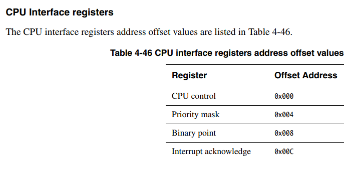
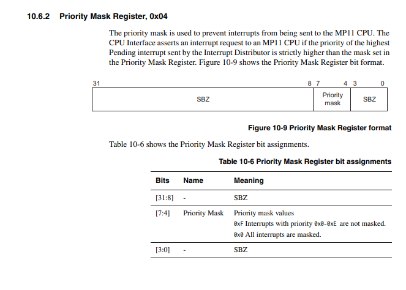
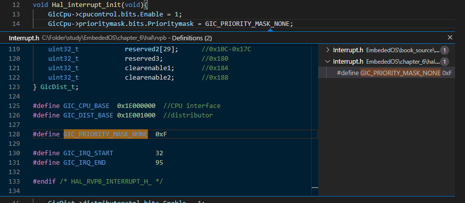

### 6. Interrupt

- 인터럽트는 임베디드 시스템을 표함한 모든 컴퓨팅 시스템의 꽃이다.
- 컴퓨팅 시스템은 외부와의 상호작용으로 인터럽트를 이용한다.
- 인터럽트는 처리하기 위해 인터럽트 컨트롤러를 사용하는 법을 알고, 인터럽트 컨트롤러를 초기화하고 사용하는 코드를 작성해야 한다.
- 익셉션 핸들러에서 적절한 인터럽트 핸들러를 호출하면 인터럽트 처리가 완료된다.
- 우선 main 함수의 맨 끝에 무한루프를 삽입해 OS를 멈춰놓고, 인터럽트를 테스트해 보자.
##
### 6.1 인터럽트 컨트롤러
- RealViewPB에는 Generic Interrupt Contoller라는 이름의 인터럽트 컨트롤러 하드웨어가 달려있다.
- 먼저 GIC의 레지스터 구조체를 만든다.
-  hal/rvpb/Interrupt.h 파일에 작성한다.
- GIC에 관한 내용은 Spec의 4.11.2장에 나와있다.
- 앞부분만 조금 살펴 보자면 아래의 이미지와 같다.
- 
-  GIC는 크게 두 그룹으로 구분된다. 
- 하나는 CPU Interface registers이고, 다른 하나는 distributor registers다.
- 실제로 GIC는 작성한 레지스터보다 훨씬 더 많은 레지스터를 가지고 있지만, 대부분 사용하지 않는 것이기 때문에 적당한 추상과 과정을 거쳤다.
- 이제 hal/rvpb/Regs.c 파일을 수정해 실제 인스턴스를 선언한다.
~~~C

#include "stdint.h"
#include "Uart.h"
#include "Interrupt.h"

volatile PL011_t*            Uart        = (PL011_t*)UART_BASE_ADDRESS0;
volatile GicCput_t*          GicCpu      = (GicCput_t*)GIC_CPU_BASE;
volatile DistributorCtrl_t*  GicDist_t   = (GicDist_t*)GIC_DIST_BASE;
~~~
- 이제 공용 API를 제작할 차례이다.
- UART와 같이, 제조사와 상관 없이 동작하도록 API를 만들어 주자.
- hal/HalInterrupt.h 파일에 작성한다.
- 초기화, 활성화, 비활성화, 핸들러 등록 등의 API를 작성한다.
~~~C
#ifndef HAL_HALINTERRUPT_H_
#define HAL_INTERRUPT_H_

#define INTERRUPT_HANDLER_NUM 255

typedef void (*InterHdlr_fptr)(void);

void Hal_interupt_init(void);
void Hal_interupt_enable(uint32_t interrupt_num);
void Hal_interupt_disable(uint32_t interrupt_num);
void Hal_interupt_register_handler(InterHdlr_fptr handler, uint32_t interrupt_num);
void Hal_interupt_run_handler(void);

#endif
~~~
- 활성화, 비활성화 함수는 인자로 인터럽트의 번호를 할당 받는다.
- 앞서 제작한 Uart는 44번이다. 따라서 Hal_interrupt_enable()에 44를 전달하면 UART 인터럽트를 키고, disable 함수에 전달하면 끄게 된다.
- ARM은 모든 인터럽를 IRQ와 FIQ 핸들러로 처리하기 때문에, 개별 이터럽트의 핸들러를 구분해야 한다.
- 그럼 이제 위에 선언한 함수를 구현해 보자.
- 구현 위치는 hal/rvpb/Interrupt.c 이다.

~~~C
#include "stdint.h"
#include "memio.h"
#include "Interrpt.h"
#include "HalInterrupt.h"
#include "armcpu.h"

extern volatile GicCput_t* GicCpu;
extern volatile GicDist_t* GicDist;

static InterHdlr_fptr sHandlers[INTERRUPT_HANDLER_NUM];

void Hal_interrupt_init(void){
    GicCpu->cpucontrol.bits.Enable = 1;
    GicCpu->prioritymask.bits.Prioritymask = GIC_PRIORITY_MASK_NONE;
    GicDist->distributorctrl.bits.Enable = 1;

    for(uint32_t i = 0; i < INTERRUPT_HANDLER_NUM ; i++){
        sHandlers[i] = NULL;
    }

    enable_irq();
}

void Hal_interrupt_enable(uint32_t interrupt_num){
    if ((interrupt_num < GIC_IRQ_START) || (GIC_IRQ_END < interrupt_num)){
        return;
    }

    uint32_t bit_num = interrupt_num - GIC_IRQ_START;

    if (bit_num < GIC_IRQ_START){
        SET_BIT(GicDist->setenable1, bit_num);
    }
    else{
        bit_num -= GIC_IRQ_START;
        SET_BIT(GicDist->setenable2, bit_num);
    }
}

void Hal_interrupt_disable(uint32_t interrupt_num){

    if ((interrupt_num < GIC_IRQ_START) || (GIC_IRQ_END < interrupt_num)){
        return;
    }

    uint32_t bit_num = interrupt_num - GIC_IRQ_START;

    if( bit_num < GIC_IRQ_START){
        CLR_BIT(GicDist->setenable1, bit_num);
    }
    else{
        bit_num -= GIC_IRQ_START;
        CLR_BIT(GicDist->setenable2, bit_num);
    }

}

void Hal_interrupt_register_handler(InterHdlr_fptr handler, uint32_t interrupt_num){
    sHandlers[interrupt_num] = handler;
}

void Hal_interrupt_run_handler(void){
    uint32_t interrupt_num = GicCpu->interruptack.bits.InterruptID;

    if(sHandlers[interrupt_num] != NULL){
        sHandlers[interrupt_num]();
    }
    GicCpu->endofinterrupt.bits.InterruptID = interrupt_num;

    
}
~~~
- `static InterHdlr_fptr sHandlers[INTERRUPT_HANDLER_NUM]` 
	- 인터럽트 핸들러 이고, 255로 선언 되었다. 함수 포인터이다.
- `Hal_interrupt_init()`
	- 이 함수는 스위치를 겨는 동작을 한다.
	- Priority mask 레지스터를 이용해 키고 끈다.
	
	- 위의 설명에 나와있듯이, 4번부터 7번비트까지가 유효한 비트이다. 
	- 0x0 으로 설정하게 되면 모든 비트를 마스크 한다.
	- 0xF로 설정하게 되면 인터럽트의 우선순위가 0x0~0xE인 인터럽트를 허용한다.
	- 위의 코드에서는 모든 인터럽트를 허용한다.
	
	- 
<!--stackedit_data:
eyJoaXN0b3J5IjpbLTU2NTEzNzUzOSw3NDExNTc1MzksMTEzMj
EwMzM4OSw0MjM4NTc4NjUsLTIxNDEwNTY3MzEsMjA4NTczNzA5
MywxNzkzNzk2NTE5LDEyNjg0MTA2NTgsMTc1MjM5NjQ4NywtMT
c0Mjg2NDE0LDE1OTI5NzE4NzMsMTI2NzIxMzc3N119
-->