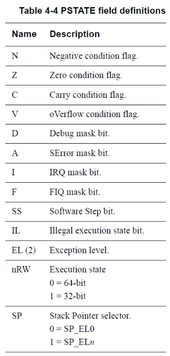

## 0. 왜  ARM Study 인가?
- ARM 아키텍쳐는 스마트폰 양대산맥인 애플과 구글진영 모두 사용중이다.
- 저전력에 강점을 가지기 때문이다.
- 향후 IoT 시대에도 같은 강점을 가지기 때문에 성장세는 지속될 것으로 보인다.
- 초기에 저전력 고성능을 인정 받으며 자리를 잡고, 이후 시장의 요구에 따라 VFP와 SIMD 등 퍼포먼스 기능과 코드 크기 감소, 가상화와 시큐리티 지원 기능 등이 추가되며 현재에 이르른다.

## 1.1 ARMv8
- ARM은 Cortex-A/R/M 시리즈로 구분된다.
	- `A` 
		- Application processor 
		- 복잡한 OS 및 사용자 응용 프로그램에 사용하는 응용 프로그램 프로세서 계열에 사용한다. ARM, Thumb 및 Thumb-2 명령어 세트를 지원한다. 현재는 Cortex-A15에 이어 Cortex-A72도 나오고 있다. 스마트 폰에 많이 사용된다.
	- `R` : Real-Time.
		-  실시간 시스템을 위한 임베디드 프로세서 계열에 사용한다. ARM, Thumb 및 Thumb-2 명령어 세트를 지원한다.
	- `M` : Microcontroller. 
		- 저가형 응용 프로그램에 최적화된 임베디드 프로세서 계열에 적합하게 설계한다. Thumb-2 명령어 세트만 지원한다. Cortex-M3는 M계열이다. 
- 여기에서는 `A` 시리즈를 타겟으로 한다.
- `ARMv8` 시리즈의 가장 큰 특징은 64비트 아키텍쳐 라는 것이다.
	- 하지만 `execution state`라는 개념을 도입해 32비트인 ARMv7도 실행 가능하다.
- `execution state`
	- 프로세서의 실행 환경을 정의하는 개념.
	- 지원하는 레지스터의 폭, ISA, Exception Model, Memory Arch 등을 정의.
	- 64비트 `execution state` 는 AArch64
	- 32비트 `execution state` 는 AArch32
- AArch64는 아래의 성능상의 이점을 제공한다.
	- 64비트 정수 데이터를 1개의 인스트럭션으로 처리.
	- 가상 주소 공간을 제공.
	- 물리 주소 범위 확장으로 4GB 이상의 주소에 접근 가능.
	- 접근 가능한 64비트 범용 레지스터 31개 제공.
	- 새로운 익셉션 모델로 OS와 하이퍼바이저의 소프트웨어 복잡성을 줄임.
	- crypto 인스트럭션의 지원으로 암호화 및 복호화 시 속도가 빨라진다.
	- 16KB와 64KB 변환 단위를 추가 하면서 TLB의 미스가 감소하고, 테이블 탐색 깊이를 줄임.
	- load-acquire, store-release 인스트럭션이 C++과 자바 메모리 모델에서 사용되므로, 명시적인 베리어 인스트럭션 없이도 스레드 세이프한 코드 구현이 가능하다.
	- 포인터 변수가 64비트의 크기로 증가해 포인터가 사용하는 메모리 증가 (BAD)

## 1.1.1 익셉션 모델

- ARMv8에서 프로세서를 바라보는 관점이 익셉션 레벨을 기준으로 변경되었다.
- 익셉션 모델은 익셉션 타입과 상태, 핸들링 루틴, 복귀 등을 말한다.

-  프로세서는 4개의 레벨 중 하나의 레벨에서 동작한다.
- 익셉션 레벨이 높을수록 더 많은 자원에 접근할 수 있다.
	- `EL0` : 어플리케이션 단
	- `EL1` : 커널
	- `EL2` : 하이퍼바이저
	- `EL3` : Secure monitor
- 프로세서 동작 상태는 시큐리티 상태에 따라 `none-secure`과 `secure`로 나뉜다.
- `none-secure`일 때는 `secure` 상태의 자원에 접근할 수 없다.
	- 둘 간의 상태 변화는 EL3에서 이루어진다.
	- `EL3`는 `Secure Monitor Call` 인스트럭션이나 하드웨어 익셉션을 통해 접근이 가능하다.
- `EL2`와 `EL3`는 옵션이므로 프로세서에서 포함되지 않을 수도있다.
	- 따라서 가상화나 하드웨어 보안 기능이 필요하다면 사전에 포함되어 있는지 확인해야 한다.
- 보안기능은 `Trustzone` 또는 `Trusted Execution Envitonment` 로 관리한다.
	- 대부분 별도의 펌웨어를 구동시켜 관리한다.

## 1.1.2 익셉션 레벨 변경
- 높은 익셉션 레벨로 변경하면 소프트웨어 실행 권한도 상승한다.
	- `EL0`는 익셉션 핸들링이 불가능하므로 `EL0`에서 발생한 익셉션은 `EL1`에서 다루도록 한다.
- 익셉션은 다음과 같은 상황에서 발생한다.
	- IRQ, FIQ 시그널
	- 메모리 시스템 Abort
	- Undefined Instruction 실행
	- System Call
	- Secure Monitor 또는 Hypervisor Trap
- 익셉션 핸들링이 끝나고 복귀할 때 `ERET` 명령을 사용한다.
- 익셉션 복귀 시에는 익셉션 발생과 반대로 동일한 레벨이나 하위 레벨로 이동한다.
- 아래권한 수준에 관한 표이다.
- 

## 1.1.3 실행 상태.
- ARMv8에는 AArch64와 AArch32 두가지의 실행 상태가 정의되어 있다.
- AArch43는 ARMv7과의 호환성을 지원하기 위해 제공된다.
- 
|  |AArch64|AArch32 |
|--|--|--|
|특징 | 64비트 실행 환경 | 32비트 실행 환경 |
|레지스터 |64비트 범용 레지스터 31개, PC, SP, ELR| 32비트 범용 레지스터 13개, PC, SP, LR|
|ISA | A64 | A32|
|주소 방식 | 64비트 가상주소 |32비트 가상주소 |
| 익셉션 모델| ARMv8익셉션 모델 | ARMv7 익셉션 모델 (ARMv8에 매핑됨) |

## 1.1.4 실행 상태 변경
- 실행 상태변경은 하이레벨 익셉션 레벨에서 원래의 익셉션 레벨로 복귀하는 과정에서 변경된다.
- `EL3`는 더 높은 레벨이 존재하지 않으므로, 리셋을 통해 레벨을 변경한다.
- `AArch32`로의 변경은 하이레벨 익셉션에서 로우레벨 익셉션으로 변경할 때만 가능하다.

- 위의 그림에서 볼 수 있듯이, `AArch32`에서는 64비트 어플리케이션을 사용할 수 없다.`EL1`에서 `EL0`로 낮아질 때 32비트에서 64비트로 변경하는 것이 불가능 하기 때문이다.

## 1.2 ARMv8 레지스터
-  `ARMv8` 는 64비트용으로 31개의 레지스터를 제공한다.
- `ARMv7`에서 프로세서 모드에 따라 제공되었던 레지스터들이 없어지고, 하나의 단일 레지스터 세트를 모든 익셉션 레벨에서 사용 가능하도록 변경한 것이다.
- 범용 레지스터에 접근할 때 `X0` ~ `X30` 으로 접근하면 64비트를 모두 사용하고, `W0` ~ `W30`이라는 이름으로 접근하면 하위 32비트만 사용한다.

## 1.2.1 프로세서 상태 레지스터 (PSTATE)
- 아래 같은 레지스터로 구성되어 있다.
- 
- 

## 1.2.2 AArch64 특수 목적 레지스터
- `AArch64`에서 범용 레지스터와 함께 특수 목적 레지스터가 추가되었다.
- `ZR`
	- Zero Register
	- 명령어 집합이 더욱 빠르고 간편하게 사용되게 해줌.
	- [https://stackoverflow.com/questions/52410521/is-zero-register-zr-in-aarch64-essentially-ground](https://stackoverflow.com/questions/52410521/is-zero-register-zr-in-aarch64-essentially-ground)
- `PC`
	- Program Counter
	- 다음에 실행한 명령어의 위치를 지정하는 레지스터
- `SP`
	- Stack Pointer
- `ELR`
	- Exception Link Register
	- 익셉션 복귀 시 돌아갈 명령어 위치를 저장하는 레지스터
- `SPSR`
	- Saved Process Status Register
	- 특정 시점의 프로세서 상태를 저장하는 레지스터.
	- 익셉션이 발생하면 프로세서에 의해 프로세서 상태가 PATATE로부터 SPSR에 저장된다.
	- 이후 복귀할 때 SPSR에서  PSTATE로 복귀한다.
## 1.2.3 시스템 레지스터
- `AArcjh64`에서 시스템 설정은 각 시스템 레지스터를 통해 제어된다.
- `MSR` 및 `MRS` 명령을 통해 접근한다.
	- `MRS x0, TTBR0_EL1` 등 ...

## 1.2.4 ABI 레지스터 사용 규칙
- 아키텍처마다 바이너리들이 상호 동작하기 위한 규칙이 존재하는데 이를 Application Binary Interface라고 한다.
- 함수 호출을 다루는 `AAPCS64`는 어셈블리와 C 사이의 인터페이스, C 함수 호출 등에 관한 내용을 다룬다.
- 
- `파라미터 레지스터 (X0~X7)`
	- 함수 호출 시 전달되는 파라미터.
	- `AArch32`는 파라미터를 4개까지 레지스터를 통해 저장하고, 초과하는 파라미터는 스택을 이용한다.
	- `X0`는 함수 결과를 리턴하는 용도로도 사용된다.
- `호출자 저장 임시 레지스터 (X9~X15)`
	- 해당 레지스터를 사용하는 경우 콜러가 자신의 스택에 레지스터를 저장한다.
- `피호출자 저장 레지스터 (X19~X29)`
	- 위와는 반대로 콜리가 복원해야 한다.
	- 호출된 함수가 메모리에 저장한다.
- `특수 목적 레지스터 (X8,X16~X18, X29,X30)`
	- `X8`은 간접 결과 레지스터로 주소 위치를 전달하는 데 사용한다.
	- `X16` `X17`은 인트라 프로시저 레지스터 (IPO,IPI)로 사용한다.
	- 서브루틴 호출 사이의 중간 값을 위한 임시 레지스터로 사용되며, 함수에 의해 수정될 수 있다.
	- `X18`은 플랫폼 ABI 용으로 사용한다.
	- `X29`는 프레임 포인터 `FP`로 사용한다.
	- `X30`은 링커 레지스터 `LR`로 사용한다.

<!--stackedit_data:
eyJoaXN0b3J5IjpbLTE5MjgzMDA3MTMsLTE2NDI4MTIzNjEsLT
E1NDIwMTY5NTgsMTI0NzY3ODY0MCwxMjc2MjUxNzE4LDY3MzMx
Njk1NSwtMTAyMzM2NjczNSwtNjQ4Mzc0Mjk5LC0zNzA2OTM2Mz
ZdfQ==
-->